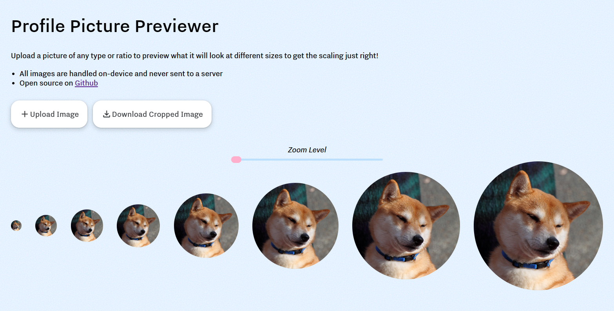

# Profile Picture Previewer

## Overview

This is a simple web application that allows you to preview how your profile picture will look at different sizes. It's perfect for ensuring your picture looks great at any size!

Check out the live demo here: [PFP Preview](http://thatmacdaddy.me/PFP-Preview/)

## Features

- Upload a profile picture and see previews at different sizes.
- Use the zoom slider to adjust the zoom level of the previews.
- Download the adjusted profile picture.

## How to Use

1. Visit the [PFP Preview page](http://thatmacdaddy.me/PFP-Preview/).
2. Click on the "Upload" button to upload your profile picture.
3. Use the zoom slider to adjust how the profile picture looks at different sizes.
4. Click the "Download" button if you want to save the adjusted profile picture.

## License

This project is available under the MIT license